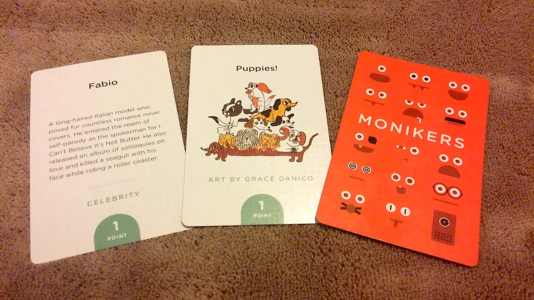

# Monikers Svelte

This is an implementation of the game [Monikers](http://www.monikersgame.com) with Svelte 3. Monikers is a party game which can be played by passing around a single phone.



## Used Material
* Icons provided by Font-awesome - CC BY 4.0 License
* CSS provided by Pure CSS - Copyright 2013 Yahoo, BSD license

## Get started

Install the dependencies...

```bash
cd monikers
npm install
```

...then start [Rollup](https://rollupjs.org):

```bash
npm run dev
```

## Deploying iOS app
Xcode includes a build script, good luck xD

## Previous version
The previous version was written with polymer. And can be found on [GitHub](https://github.com/yene/monikers)
